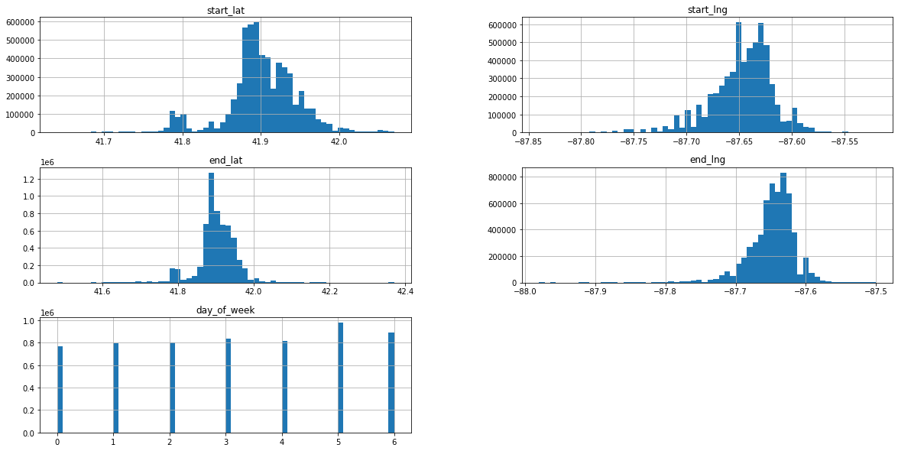

# Data Cleaning Process

## 1. Document description
------

#### This document outlines all of the steps taken to clean and transform Cyclistic’s raw datasets to prepare the data for the next stage of analysis. For the purpose of this case study, only data collected between August 2021 - July 2022 will be assessed. The dataset description can be located [here](https://ride.divvybikes.com/system-data).

#### Please note that Cyclistic is a fictional company. Raw data has been collected by Motivate International Inc, the company which operates the City of Chicago’s Divvy bicycle sharing service. The license to use this public dataset can be found [here](https://ride.divvybikes.com/data-license-agreement).

## 2. Import packages and Load Data
----


```python
import pandas as pd
import numpy as np
```


```python
#Load data
aug_21 = pd.read_csv('/Users/wengieong/Desktop/CaseStudy/202108-divvy-tripdata.csv')
sep_21 = pd.read_csv('/Users/wengieong/Desktop/CaseStudy/202109-divvy-tripdata.csv')
oct_21 = pd.read_csv('/Users/wengieong/Desktop/CaseStudy/202110-divvy-tripdata.csv')
nov_21 = pd.read_csv('/Users/wengieong/Desktop/CaseStudy/202111-divvy-tripdata.csv')
dec_21 = pd.read_csv('/Users/wengieong/Desktop/CaseStudy/202112-divvy-tripdata.csv')
jan_22 = pd.read_csv('/Users/wengieong/Desktop/CaseStudy/202201-divvy-tripdata.csv')
feb_22 = pd.read_csv('/Users/wengieong/Desktop/CaseStudy/202202-divvy-tripdata.csv')
mar_22 = pd.read_csv('/Users/wengieong/Desktop/CaseStudy/202203-divvy-tripdata.csv')
apr_22 = pd.read_csv('/Users/wengieong/Desktop/CaseStudy/202204-divvy-tripdata.csv')
may_22 = pd.read_csv('/Users/wengieong/Desktop/CaseStudy/202205-divvy-tripdata.csv')
jun_22 = pd.read_csv('/Users/wengieong/Desktop/CaseStudy/202206-divvy-tripdata.csv')
jul_22 = pd.read_csv('/Users/wengieong/Desktop/CaseStudy/202207-divvy-tripdata.csv')

```


```python
#Check data string type
aug_21.dtypes
sep_21.dtypes
oct_21.dtypes
nov_21.dtypes
oct_21.dtypes
nov_21.dtypes
dec_21.dtypes
jan_22.dtypes
feb_22.dtypes
mar_22.dtypes
apr_22.dtypes
may_22.dtypes
jun_22.dtypes
jul_22.dtypes
```


```python
#Merge 12 months data into one
year = [aug_21, sep_21, oct_21, nov_21, dec_21, jan_22, feb_22, mar_22, apr_22, may_22, jun_22, jul_22]
all_trips = pd.concat(year)
```

## 3. Prepare dataset
------

### 3.1 Change data string types

#### The started_at and ended_at columns should be changed to a datetime string type to help with analysis.


```python
#Sort the full year data by date and time
all_trips=all_trips.sort_values(by=['started_at'])

```


```python
#Format started_at and ended_at to datetime index
from datetime import datetime
end_time = pd.to_datetime(all_trips['ended_at'], format= '%Y-%m-%d %H:%M:%S')

start_time = pd.to_datetime(all_trips['started_at'], format= '%Y-%m-%d %H:%M:%S')

```

### 3.2 Calculate ride length

#### By calculating the ride length, we can if there is any invalid data points. For example, the ride length result in negative means the end time is earlier than the start time. Moreover, ride length can be used to analyze users' habits.


```python
#Calculate time difference between start and end time
all_trips['ride_length'] = end_time - start_time

#Check the minimum ride_length
all_trips.sort_values(by = ['ride_length'])
```


```python
#Remove the rows for which ride_length are negative
all_trips_cleaned = all_trips[all_trips['ride_length'].dt.days >= 0]
```

### 3.3 Summarise by sate variables

#### Split columns for date, time, and weekday for future analysis purpose.


```python
#Split date and time into new columns
all_trips['start_date'] = pd.to_datetime(all_trips['started_at']).dt.date
all_trips['start_time'] = pd.to_datetime(all_trips['started_at']).dt.time
all_trips['end_date'] = pd.to_datetime(all_trips['ended_at']).dt.date
all_trips['end_time'] = pd.to_datetime(all_trips['ended_at']).dt.time
all_trips['day_of_week'] = pd.to_datetime(all_trips['start_date']).dt.weekday
```

## 4. Clean dataset
--------

### 4.1 Remove null values

#### Null values will affect the analysis result, we should eliminate the null value by either removing the rows or columns.


```python
#Check the null value
all_trips_cleaned.isna().sum()
```


    ride_id                    0
    rideable_type              0
    started_at                 0
    ended_at                   0
    start_station_name    860759
    start_station_id      860757
    end_station_name      919871
    end_station_id        919871
    start_lat                  0
    start_lng                  0
    end_lat                 5590
    end_lng                 5590
    member_casual              0
    ride_length                0
    start_date                 0
    start_time                 0
    end_date                   0
    end_time                   0
    day_of_week                0
    dtype: int64


```python
#Remove the startion name and station id columns
all_trips_cleaned = all_trips_cleaned[['ride_id','rideable_type','started_at','ended_at','start_lat','start_lng','end_lat','end_lng','member_casual', 'ride_length','start_date','start_time','end_date','end_time','day_of_week']]
```


```python
#Drop rows that contain null in end_lat and end_lng
all_trips_cleaned = all_trips_cleaned.dropna(subset=['end_lat','end_lng'])
```

### 4.2 Remove outliers

#### Outliers can be detected through histogram, removing the outliers can improve the accuracy of the analysis.


```python
#Check outliers
all_trips_cleaned.hist(bins=60,figsize=(20,10))
```


    array([[<AxesSubplot:title={'center':'start_lat'}>,
            <AxesSubplot:title={'center':'start_lng'}>],
           [<AxesSubplot:title={'center':'end_lat'}>,
            <AxesSubplot:title={'center':'end_lng'}>],
           [<AxesSubplot:title={'center':'day_of_week'}>, <AxesSubplot:>]],
          dtype=object)


    

    


```python
all_trips_cleaned.describe()
```


<div>
<style scoped>
    .dataframe tbody tr th:only-of-type {
        vertical-align: middle;
    }

    .dataframe tbody tr th {
        vertical-align: top;
    }

    .dataframe thead th {
        text-align: right;
    }
</style>
<table border="1" class="dataframe">
  <thead>
    <tr style="text-align: right;">
      <th></th>
      <th>start_lat</th>
      <th>start_lng</th>
      <th>end_lat</th>
      <th>end_lng</th>
      <th>ride_length</th>
    </tr>
  </thead>
  <tbody>
    <tr>
      <th>count</th>
      <td>5.895721e+06</td>
      <td>5.895721e+06</td>
      <td>5.895721e+06</td>
      <td>5.895721e+06</td>
      <td>5895721</td>
    </tr>
    <tr>
      <th>mean</th>
      <td>4.190079e+01</td>
      <td>-8.764743e+01</td>
      <td>4.190102e+01</td>
      <td>-8.764761e+01</td>
      <td>0 days 00:17:48.422204510</td>
    </tr>
    <tr>
      <th>std</th>
      <td>4.720421e-02</td>
      <td>3.039968e-02</td>
      <td>4.734829e-02</td>
      <td>3.055978e-02</td>
      <td>0 days 01:13:44.768548840</td>
    </tr>
    <tr>
      <th>min</th>
      <td>4.164000e+01</td>
      <td>-8.784000e+01</td>
      <td>4.148000e+01</td>
      <td>-8.798000e+01</td>
      <td>0 days 00:00:00</td>
    </tr>
    <tr>
      <th>25%</th>
      <td>4.188103e+01</td>
      <td>-8.766154e+01</td>
      <td>4.188103e+01</td>
      <td>-8.766241e+01</td>
      <td>0 days 00:06:10</td>
    </tr>
    <tr>
      <th>50%</th>
      <td>4.189964e+01</td>
      <td>-8.764336e+01</td>
      <td>4.190000e+01</td>
      <td>-8.764375e+01</td>
      <td>0 days 00:10:57</td>
    </tr>
    <tr>
      <th>75%</th>
      <td>4.192957e+01</td>
      <td>-8.762872e+01</td>
      <td>4.192968e+01</td>
      <td>-8.762910e+01</td>
      <td>0 days 00:19:46</td>
    </tr>
    <tr>
      <th>max</th>
      <td>4.207000e+01</td>
      <td>-8.752000e+01</td>
      <td>4.237000e+01</td>
      <td>-8.750000e+01</td>
      <td>28 days 21:49:10</td>
    </tr>
  </tbody>
</table>
</div>


```python
#Remove outliers
all_trips_cleaned = all_trips_cleaned[all_trips_cleaned['start_lat'] <= 42.5]
all_trips_cleaned = all_trips_cleaned[all_trips_cleaned['end_lng'] >= -88]

```

### 4.3 Remove duplicates

#### Check and remove the duplicated rows to complete the cleaning process


```python
#Drop duplicated rows
all_trips_cleaned.drop_duplicates(subset=None, keep='first', inplace=False, ignore_index=False)
```


<div>
<style scoped>
    .dataframe tbody tr th:only-of-type {
        vertical-align: middle;
    }

    .dataframe tbody tr th {
        vertical-align: top;
    }

    .dataframe thead th {
        text-align: right;
    }
</style>
<table border="1" class="dataframe">
  <thead>
    <tr style="text-align: right;">
      <th></th>
      <th>ride_id</th>
      <th>rideable_type</th>
      <th>started_at</th>
      <th>ended_at</th>
      <th>start_lat</th>
      <th>start_lng</th>
      <th>end_lat</th>
      <th>end_lng</th>
      <th>member_casual</th>
      <th>ride_length</th>
      <th>start_date</th>
      <th>start_time</th>
      <th>end_date</th>
      <th>end_time</th>
      <th>day_of_week</th>
    </tr>
  </thead>
  <tbody>
    <tr>
      <th>175325</th>
      <td>D6AC43863387B96A</td>
      <td>classic_bike</td>
      <td>2021-08-01 00:00:04</td>
      <td>2021-08-01 00:13:28</td>
      <td>41.929546</td>
      <td>-87.643118</td>
      <td>41.928830</td>
      <td>-87.668507</td>
      <td>member</td>
      <td>0 days 00:13:24</td>
      <td>2021-08-01</td>
      <td>00:00:04</td>
      <td>2021-08-01</td>
      <td>00:13:28</td>
      <td>6</td>
    </tr>
    <tr>
      <th>25013</th>
      <td>00015E7CD37F64C4</td>
      <td>classic_bike</td>
      <td>2021-08-01 00:00:17</td>
      <td>2021-08-01 00:05:10</td>
      <td>41.925563</td>
      <td>-87.658404</td>
      <td>41.929143</td>
      <td>-87.649077</td>
      <td>member</td>
      <td>0 days 00:04:53</td>
      <td>2021-08-01</td>
      <td>00:00:17</td>
      <td>2021-08-01</td>
      <td>00:05:10</td>
      <td>6</td>
    </tr>
    <tr>
      <th>782029</th>
      <td>3B9554C394136D13</td>
      <td>classic_bike</td>
      <td>2021-08-01 00:00:19</td>
      <td>2021-08-01 00:05:54</td>
      <td>41.894722</td>
      <td>-87.634362</td>
      <td>41.906724</td>
      <td>-87.634830</td>
      <td>casual</td>
      <td>0 days 00:05:35</td>
      <td>2021-08-01</td>
      <td>00:00:19</td>
      <td>2021-08-01</td>
      <td>00:05:54</td>
      <td>6</td>
    </tr>
    <tr>
      <th>397098</th>
      <td>3F35D7C35A1DB902</td>
      <td>classic_bike</td>
      <td>2021-08-01 00:00:27</td>
      <td>2021-08-01 00:12:17</td>
      <td>41.919936</td>
      <td>-87.648830</td>
      <td>41.940180</td>
      <td>-87.653040</td>
      <td>member</td>
      <td>0 days 00:11:50</td>
      <td>2021-08-01</td>
      <td>00:00:27</td>
      <td>2021-08-01</td>
      <td>00:12:17</td>
      <td>6</td>
    </tr>
    <tr>
      <th>777801</th>
      <td>A39DD0D9AD715E27</td>
      <td>classic_bike</td>
      <td>2021-08-01 00:00:32</td>
      <td>2021-08-01 00:12:06</td>
      <td>41.949074</td>
      <td>-87.648636</td>
      <td>41.943340</td>
      <td>-87.670970</td>
      <td>casual</td>
      <td>0 days 00:11:34</td>
      <td>2021-08-01</td>
      <td>00:00:32</td>
      <td>2021-08-01</td>
      <td>00:12:06</td>
      <td>6</td>
    </tr>
    <tr>
      <th>...</th>
      <td>...</td>
      <td>...</td>
      <td>...</td>
      <td>...</td>
      <td>...</td>
      <td>...</td>
      <td>...</td>
      <td>...</td>
      <td>...</td>
      <td>...</td>
      <td>...</td>
      <td>...</td>
      <td>...</td>
      <td>...</td>
      <td>...</td>
    </tr>
    <tr>
      <th>147856</th>
      <td>E77BC768DD3C65C4</td>
      <td>electric_bike</td>
      <td>2022-07-31 23:58:58</td>
      <td>2022-08-01 00:05:11</td>
      <td>41.830123</td>
      <td>-87.670314</td>
      <td>41.830661</td>
      <td>-87.647172</td>
      <td>casual</td>
      <td>0 days 00:06:13</td>
      <td>2022-07-31</td>
      <td>23:58:58</td>
      <td>2022-08-01</td>
      <td>00:05:11</td>
      <td>6</td>
    </tr>
    <tr>
      <th>743852</th>
      <td>B8DE5E943AE3139E</td>
      <td>electric_bike</td>
      <td>2022-07-31 23:58:58</td>
      <td>2022-08-01 00:28:14</td>
      <td>41.910000</td>
      <td>-87.750000</td>
      <td>41.900000</td>
      <td>-87.750000</td>
      <td>member</td>
      <td>0 days 00:29:16</td>
      <td>2022-07-31</td>
      <td>23:58:58</td>
      <td>2022-08-01</td>
      <td>00:28:14</td>
      <td>6</td>
    </tr>
    <tr>
      <th>618136</th>
      <td>9D9B50749D946176</td>
      <td>classic_bike</td>
      <td>2022-07-31 23:59:05</td>
      <td>2022-08-01 00:24:14</td>
      <td>41.894345</td>
      <td>-87.622798</td>
      <td>41.929143</td>
      <td>-87.649077</td>
      <td>member</td>
      <td>0 days 00:25:09</td>
      <td>2022-07-31</td>
      <td>23:59:05</td>
      <td>2022-08-01</td>
      <td>00:24:14</td>
      <td>6</td>
    </tr>
    <tr>
      <th>264294</th>
      <td>BE56236D4E602A10</td>
      <td>classic_bike</td>
      <td>2022-07-31 23:59:29</td>
      <td>2022-08-01 00:06:24</td>
      <td>41.954690</td>
      <td>-87.673930</td>
      <td>41.967096</td>
      <td>-87.667429</td>
      <td>member</td>
      <td>0 days 00:06:55</td>
      <td>2022-07-31</td>
      <td>23:59:29</td>
      <td>2022-08-01</td>
      <td>00:06:24</td>
      <td>6</td>
    </tr>
    <tr>
      <th>702112</th>
      <td>1715A3889F15156C</td>
      <td>electric_bike</td>
      <td>2022-07-31 23:59:58</td>
      <td>2022-08-01 00:44:34</td>
      <td>41.680000</td>
      <td>-87.660000</td>
      <td>41.760000</td>
      <td>-87.560000</td>
      <td>casual</td>
      <td>0 days 00:44:36</td>
      <td>2022-07-31</td>
      <td>23:59:58</td>
      <td>2022-08-01</td>
      <td>00:44:34</td>
      <td>6</td>
    </tr>
  </tbody>
</table>
<p>5895721 rows × 15 columns</p>
</div>


#### The above code return the same number of rows as before, which means no duplicates are recorded in the cleaned dataset

## 5. Save the dataset
--------------------------

#### The cleaned dataset should be saved as a .csv file.

#Save the cleaned dataset
all_trips_cleaned.to_csv('all_trips_cleaned.csv')


```python

```


```python

```


```python

```
