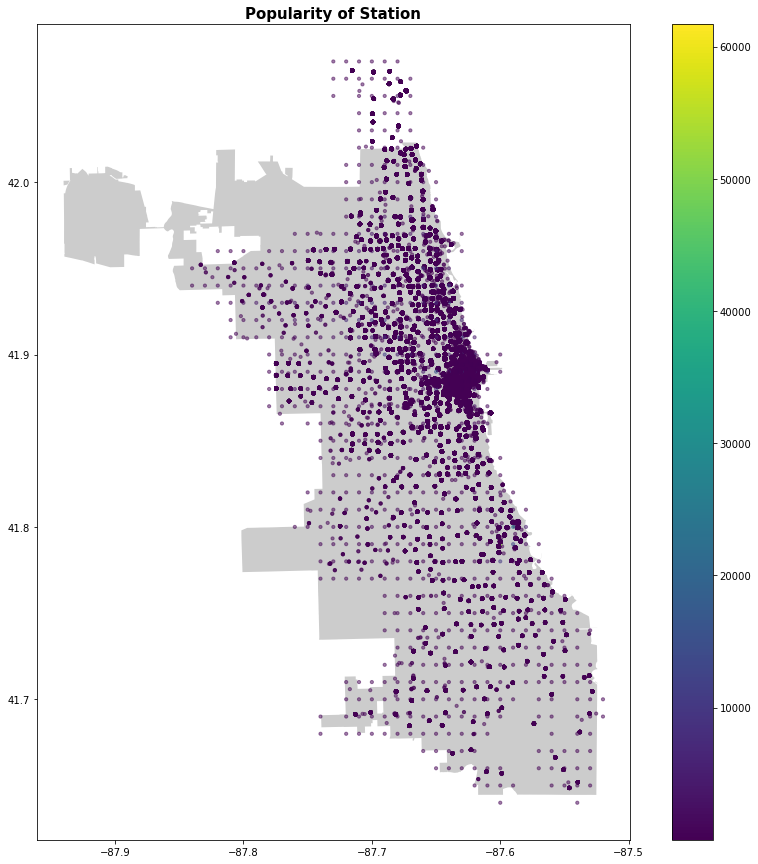
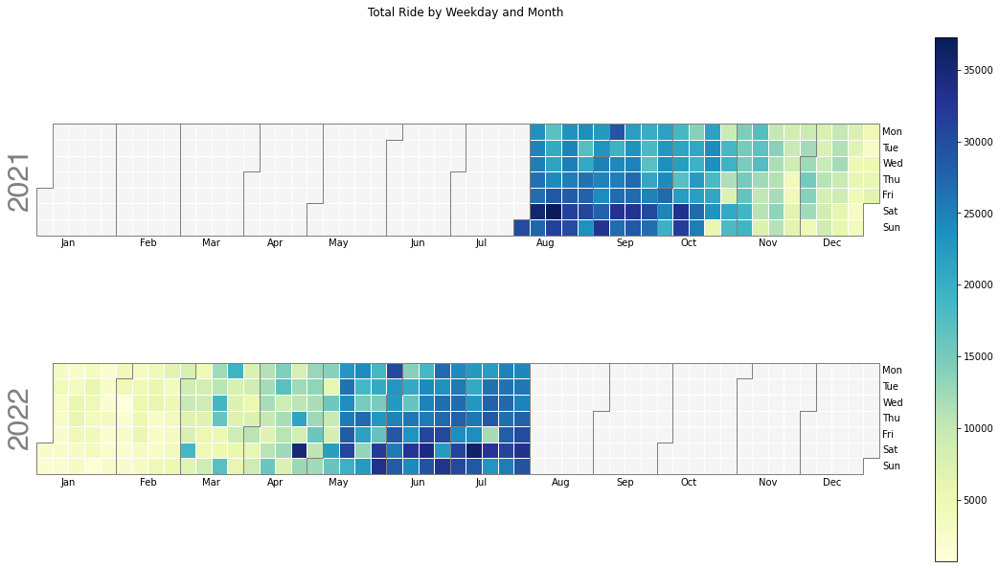
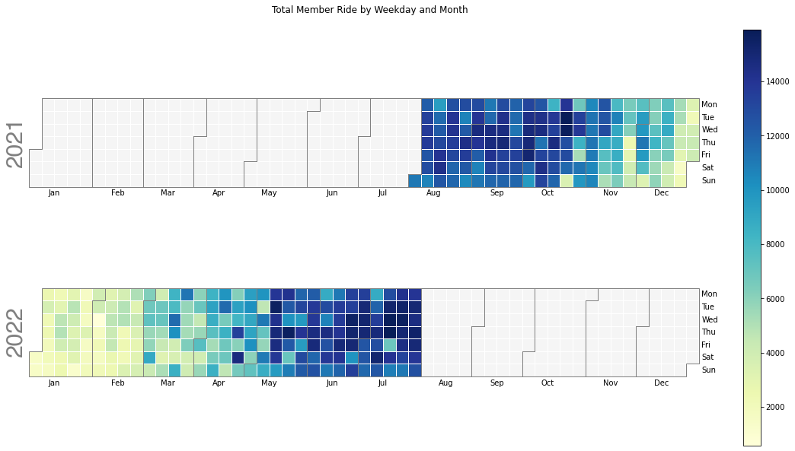
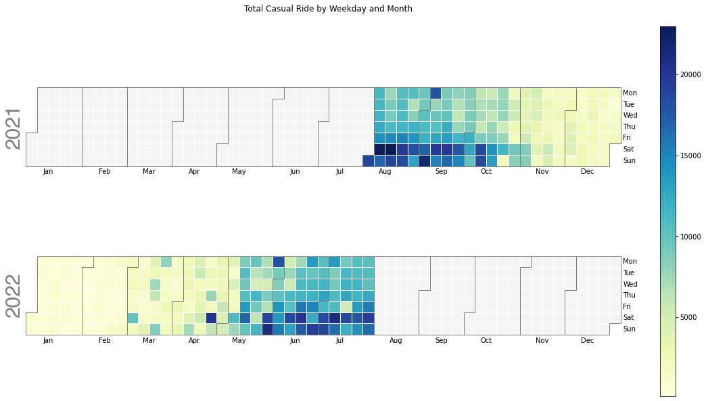
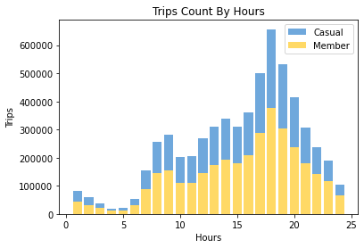

# Final Report Code


## 1. Import packages and cleaned dataset
-----


```python
import matplotlib.pyplot as plt
import numpy as np
import pandas as pd
import folium
import seaborn as sns
import geopandas as gpd
from shapely.geometry import Point, Polygon
import calplot
```


```python
data = pd.read_csv('all_trips_cleaned.csv')
```

## 2. Most popular station
----


```python
#Import street map
street_map = gpd.read_file('/Users/wengieong/Desktop/Boundaries/geo_export_88179371-b1e2-429b-ba2b-a61d0fd251cb.shp')
```


```python
geo_df = data
```


```python
#Combine start longitude and start latitude to point
geo_df['point'] = geo_df['start_lng'].astype(str) + ',' +geo_df['start_lat'].astype(str)
```


```python
geo_df
```


<div>
<style scoped>
    .dataframe tbody tr th:only-of-type {
        vertical-align: middle;
    }

    .dataframe tbody tr th {
        vertical-align: top;
    }

    .dataframe thead th {
        text-align: right;
    }
</style>
<table border="1" class="dataframe">
  <thead>
    <tr style="text-align: right;">
      <th></th>
      <th>Unnamed: 0</th>
      <th>ride_id</th>
      <th>rideable_type</th>
      <th>started_at</th>
      <th>ended_at</th>
      <th>start_lat</th>
      <th>start_lng</th>
      <th>end_lat</th>
      <th>end_lng</th>
      <th>member_casual</th>
      <th>ride_length</th>
      <th>start_date</th>
      <th>start_time</th>
      <th>end_date</th>
      <th>end_time</th>
      <th>day_of_week</th>
      <th>point</th>
    </tr>
  </thead>
  <tbody>
    <tr>
      <th>0</th>
      <td>175325</td>
      <td>D6AC43863387B96A</td>
      <td>classic_bike</td>
      <td>2021-08-01 00:00:04</td>
      <td>2021-08-01 00:13:28</td>
      <td>41.929546</td>
      <td>-87.643118</td>
      <td>41.928830</td>
      <td>-87.668507</td>
      <td>member</td>
      <td>0 days 00:13:24</td>
      <td>2021-08-01</td>
      <td>00:00:04</td>
      <td>2021-08-01</td>
      <td>00:13:28</td>
      <td>6</td>
      <td>-87.643118,41.929546</td>
    </tr>
    <tr>
      <th>1</th>
      <td>25013</td>
      <td>00015E7CD37F64C4</td>
      <td>classic_bike</td>
      <td>2021-08-01 00:00:17</td>
      <td>2021-08-01 00:05:10</td>
      <td>41.925563</td>
      <td>-87.658404</td>
      <td>41.929143</td>
      <td>-87.649077</td>
      <td>member</td>
      <td>0 days 00:04:53</td>
      <td>2021-08-01</td>
      <td>00:00:17</td>
      <td>2021-08-01</td>
      <td>00:05:10</td>
      <td>6</td>
      <td>-87.65840426,41.92556258</td>
    </tr>
    <tr>
      <th>2</th>
      <td>782029</td>
      <td>3B9554C394136D13</td>
      <td>classic_bike</td>
      <td>2021-08-01 00:00:19</td>
      <td>2021-08-01 00:05:54</td>
      <td>41.894722</td>
      <td>-87.634362</td>
      <td>41.906724</td>
      <td>-87.634830</td>
      <td>casual</td>
      <td>0 days 00:05:35</td>
      <td>2021-08-01</td>
      <td>00:00:19</td>
      <td>2021-08-01</td>
      <td>00:05:54</td>
      <td>6</td>
      <td>-87.634362,41.894722</td>
    </tr>
    <tr>
      <th>3</th>
      <td>397098</td>
      <td>3F35D7C35A1DB902</td>
      <td>classic_bike</td>
      <td>2021-08-01 00:00:27</td>
      <td>2021-08-01 00:12:17</td>
      <td>41.919936</td>
      <td>-87.648830</td>
      <td>41.940180</td>
      <td>-87.653040</td>
      <td>member</td>
      <td>0 days 00:11:50</td>
      <td>2021-08-01</td>
      <td>00:00:27</td>
      <td>2021-08-01</td>
      <td>00:12:17</td>
      <td>6</td>
      <td>-87.64883,41.919936</td>
    </tr>
    <tr>
      <th>4</th>
      <td>777801</td>
      <td>A39DD0D9AD715E27</td>
      <td>classic_bike</td>
      <td>2021-08-01 00:00:32</td>
      <td>2021-08-01 00:12:06</td>
      <td>41.949074</td>
      <td>-87.648636</td>
      <td>41.943340</td>
      <td>-87.670970</td>
      <td>casual</td>
      <td>0 days 00:11:34</td>
      <td>2021-08-01</td>
      <td>00:00:32</td>
      <td>2021-08-01</td>
      <td>00:12:06</td>
      <td>6</td>
      <td>-87.648636,41.949074</td>
    </tr>
    <tr>
      <th>...</th>
      <td>...</td>
      <td>...</td>
      <td>...</td>
      <td>...</td>
      <td>...</td>
      <td>...</td>
      <td>...</td>
      <td>...</td>
      <td>...</td>
      <td>...</td>
      <td>...</td>
      <td>...</td>
      <td>...</td>
      <td>...</td>
      <td>...</td>
      <td>...</td>
      <td>...</td>
    </tr>
    <tr>
      <th>5895716</th>
      <td>147856</td>
      <td>E77BC768DD3C65C4</td>
      <td>electric_bike</td>
      <td>2022-07-31 23:58:58</td>
      <td>2022-08-01 00:05:11</td>
      <td>41.830123</td>
      <td>-87.670314</td>
      <td>41.830661</td>
      <td>-87.647172</td>
      <td>casual</td>
      <td>0 days 00:06:13</td>
      <td>2022-07-31</td>
      <td>23:58:58</td>
      <td>2022-08-01</td>
      <td>00:05:11</td>
      <td>6</td>
      <td>-87.67031416666667,41.83012333333333</td>
    </tr>
    <tr>
      <th>5895717</th>
      <td>743852</td>
      <td>B8DE5E943AE3139E</td>
      <td>electric_bike</td>
      <td>2022-07-31 23:58:58</td>
      <td>2022-08-01 00:28:14</td>
      <td>41.910000</td>
      <td>-87.750000</td>
      <td>41.900000</td>
      <td>-87.750000</td>
      <td>member</td>
      <td>0 days 00:29:16</td>
      <td>2022-07-31</td>
      <td>23:58:58</td>
      <td>2022-08-01</td>
      <td>00:28:14</td>
      <td>6</td>
      <td>-87.75,41.91</td>
    </tr>
    <tr>
      <th>5895718</th>
      <td>618136</td>
      <td>9D9B50749D946176</td>
      <td>classic_bike</td>
      <td>2022-07-31 23:59:05</td>
      <td>2022-08-01 00:24:14</td>
      <td>41.894345</td>
      <td>-87.622798</td>
      <td>41.929143</td>
      <td>-87.649077</td>
      <td>member</td>
      <td>0 days 00:25:09</td>
      <td>2022-07-31</td>
      <td>23:59:05</td>
      <td>2022-08-01</td>
      <td>00:24:14</td>
      <td>6</td>
      <td>-87.62279838323593,41.89434513742426</td>
    </tr>
    <tr>
      <th>5895719</th>
      <td>264294</td>
      <td>BE56236D4E602A10</td>
      <td>classic_bike</td>
      <td>2022-07-31 23:59:29</td>
      <td>2022-08-01 00:06:24</td>
      <td>41.954690</td>
      <td>-87.673930</td>
      <td>41.967096</td>
      <td>-87.667429</td>
      <td>member</td>
      <td>0 days 00:06:55</td>
      <td>2022-07-31</td>
      <td>23:59:29</td>
      <td>2022-08-01</td>
      <td>00:06:24</td>
      <td>6</td>
      <td>-87.67393,41.95469</td>
    </tr>
    <tr>
      <th>5895720</th>
      <td>702112</td>
      <td>1715A3889F15156C</td>
      <td>electric_bike</td>
      <td>2022-07-31 23:59:58</td>
      <td>2022-08-01 00:44:34</td>
      <td>41.680000</td>
      <td>-87.660000</td>
      <td>41.760000</td>
      <td>-87.560000</td>
      <td>casual</td>
      <td>0 days 00:44:36</td>
      <td>2022-07-31</td>
      <td>23:59:58</td>
      <td>2022-08-01</td>
      <td>00:44:34</td>
      <td>6</td>
      <td>-87.66,41.68</td>
    </tr>
  </tbody>
</table>
<p>5895721 rows × 17 columns</p>
</div>


```python
#Group data by longitude and latitude point and count
geo_group = geo_df.groupby('point').agg('count').reset_index()

```


```python
#Extract only the point and ride_id column
geo_df1 = geo_group[['point','ride_id',]]

```


```python
#Convert point to string 
geo_df1["point"].to_string()
```


```python
#Split point into longitude and latitude columns
geo_df1[['lng','lat']] = geo_df1['point'].str.split(',', expand = True)
```


```python
geo_df1
```


<div>
<style scoped>
    .dataframe tbody tr th:only-of-type {
        vertical-align: middle;
    }

    .dataframe tbody tr th {
        vertical-align: top;
    }

    .dataframe thead th {
        text-align: right;
    }
</style>
<table border="1" class="dataframe">
  <thead>
    <tr style="text-align: right;">
      <th></th>
      <th>point</th>
      <th>ride_id</th>
      <th>lng</th>
      <th>lat</th>
    </tr>
  </thead>
  <tbody>
    <tr>
      <th>0</th>
      <td>-87.52,41.69</td>
      <td>35</td>
      <td>-87.52</td>
      <td>41.69</td>
    </tr>
    <tr>
      <th>1</th>
      <td>-87.52,41.7</td>
      <td>7</td>
      <td>-87.52</td>
      <td>41.7</td>
    </tr>
    <tr>
      <th>2</th>
      <td>-87.525314,41.69172683333333</td>
      <td>1</td>
      <td>-87.525314</td>
      <td>41.69172683333333</td>
    </tr>
    <tr>
      <th>3</th>
      <td>-87.52823173999786,41.7045750872071</td>
      <td>92</td>
      <td>-87.52823173999786</td>
      <td>41.7045750872071</td>
    </tr>
    <tr>
      <th>4</th>
      <td>-87.528232,41.704575</td>
      <td>38</td>
      <td>-87.528232</td>
      <td>41.704575</td>
    </tr>
    <tr>
      <th>...</th>
      <td>...</td>
      <td>...</td>
      <td>...</td>
      <td>...</td>
    </tr>
    <tr>
      <th>1693505</th>
      <td>-87.83324883333333,41.95202883333333</td>
      <td>1</td>
      <td>-87.83324883333333</td>
      <td>41.95202883333333</td>
    </tr>
    <tr>
      <th>1693506</th>
      <td>-87.83325416666666,41.9520125</td>
      <td>1</td>
      <td>-87.83325416666666</td>
      <td>41.9520125</td>
    </tr>
    <tr>
      <th>1693507</th>
      <td>-87.8332685,41.9520485</td>
      <td>1</td>
      <td>-87.8332685</td>
      <td>41.9520485</td>
    </tr>
    <tr>
      <th>1693508</th>
      <td>-87.84,41.94</td>
      <td>7</td>
      <td>-87.84</td>
      <td>41.94</td>
    </tr>
    <tr>
      <th>1693509</th>
      <td>-87.84,41.95</td>
      <td>15</td>
      <td>-87.84</td>
      <td>41.95</td>
    </tr>
  </tbody>
</table>
<p>1693510 rows × 4 columns</p>
</div>


```python
#Convert longitude and latitude to float
geo_df1['lng'] = geo_df1['lng'].astype(float)
geo_df1['lat'] = geo_df1['lat'].astype(float)

```


```python
#Designate coordinate system
crs = {'init':'epsg:4326'}
#Zip x and y coordinates into single feature
geometry = [Point(xy) for xy in zip(geo_df1['lng'], geo_df1['lat'])]
#Create GeoPandas dataframe
geo_data2 = gpd.GeoDataFrame(geo_df1,
                             crs = crs,
                             geometry = geometry)
```


```python
geo_data2
```


<div>
<style scoped>
    .dataframe tbody tr th:only-of-type {
        vertical-align: middle;
    }

    .dataframe tbody tr th {
        vertical-align: top;
    }

    .dataframe thead th {
        text-align: right;
    }
</style>
<table border="1" class="dataframe">
  <thead>
    <tr style="text-align: right;">
      <th></th>
      <th>point</th>
      <th>ride_id</th>
      <th>lng</th>
      <th>lat</th>
      <th>geometry</th>
    </tr>
  </thead>
  <tbody>
    <tr>
      <th>0</th>
      <td>-87.52,41.69</td>
      <td>35</td>
      <td>-87.520000</td>
      <td>41.690000</td>
      <td>POINT (-87.52000 41.69000)</td>
    </tr>
    <tr>
      <th>1</th>
      <td>-87.52,41.7</td>
      <td>7</td>
      <td>-87.520000</td>
      <td>41.700000</td>
      <td>POINT (-87.52000 41.70000)</td>
    </tr>
    <tr>
      <th>2</th>
      <td>-87.525314,41.69172683333333</td>
      <td>1</td>
      <td>-87.525314</td>
      <td>41.691727</td>
      <td>POINT (-87.52531 41.69173)</td>
    </tr>
    <tr>
      <th>3</th>
      <td>-87.52823173999786,41.7045750872071</td>
      <td>92</td>
      <td>-87.528232</td>
      <td>41.704575</td>
      <td>POINT (-87.52823 41.70458)</td>
    </tr>
    <tr>
      <th>4</th>
      <td>-87.528232,41.704575</td>
      <td>38</td>
      <td>-87.528232</td>
      <td>41.704575</td>
      <td>POINT (-87.52823 41.70457)</td>
    </tr>
    <tr>
      <th>...</th>
      <td>...</td>
      <td>...</td>
      <td>...</td>
      <td>...</td>
      <td>...</td>
    </tr>
    <tr>
      <th>1693505</th>
      <td>-87.83324883333333,41.95202883333333</td>
      <td>1</td>
      <td>-87.833249</td>
      <td>41.952029</td>
      <td>POINT (-87.83325 41.95203)</td>
    </tr>
    <tr>
      <th>1693506</th>
      <td>-87.83325416666666,41.9520125</td>
      <td>1</td>
      <td>-87.833254</td>
      <td>41.952013</td>
      <td>POINT (-87.83325 41.95201)</td>
    </tr>
    <tr>
      <th>1693507</th>
      <td>-87.8332685,41.9520485</td>
      <td>1</td>
      <td>-87.833269</td>
      <td>41.952048</td>
      <td>POINT (-87.83327 41.95205)</td>
    </tr>
    <tr>
      <th>1693508</th>
      <td>-87.84,41.94</td>
      <td>7</td>
      <td>-87.840000</td>
      <td>41.940000</td>
      <td>POINT (-87.84000 41.94000)</td>
    </tr>
    <tr>
      <th>1693509</th>
      <td>-87.84,41.95</td>
      <td>15</td>
      <td>-87.840000</td>
      <td>41.950000</td>
      <td>POINT (-87.84000 41.95000)</td>
    </tr>
  </tbody>
</table>
<p>1693510 rows × 5 columns</p>
</div>


```python
#Create figure and axes, assign to subplot
fig,ax = plt.subplots(figsize=(15,15))
#Add .shp mapfile to axes
street_map.plot(ax=ax, alpha=0.4,color='grey')

#Add geodataframe to axes
#Assign 'ride_id' variable to represent coordinates on graph
#Add legend
#Make datapoints transparent using alpha
#Assign size of points using markersize
geo_data2.plot(column='ride_id',ax=ax,alpha=0.5, legend=True,markersize=10)

#Add title to graph
plt.title('Popularity of Station', fontsize=15,fontweight='bold')

#Save figure
plt.savefig('popularity_of_station')

#Show map
plt.show()
```


    

    


## 3. Most popular time of year
---

### 3.1 Total ride by weekday and month


```python
#Change the type of data
data['start_date'] = pd.to_datetime(data['start_date'])
#Set orderdate as index
data.set_index('start_date', inplace = True)
```


```python
#Group the orders by date and count the number of orders per day
counts = data.groupby('start_date')['ride_id'].agg( 'count').reset_index()
counts['start_date'] = pd.to_datetime(counts['start_date'])
```


```python
#Sort the value by start date
year = counts.sort_values(by='start_date').set_index('start_date')
```


```python
#Create the plot
calplot.calplot(year['ride_id'], cmap = 'YlGnBu', figsize = (16, 8), suptitle = "Total Ride by Weekday and Month")
plt.savefig('total_ride_by_weekday_and_month')
```


    

    


### 3.2 Total member ride by weekday and month


```python
#Filter the data to only member's data
member = data[data["member_casual"]=='member']
```


```python
#Group the orders by date and count the number of orders per day
member_counts = member.groupby('start_date')['ride_id'].agg( 'count').reset_index()
member_counts['start_date'] = pd.to_datetime(member_counts['start_date'])
```


```python
member_year = member_counts.sort_values(by='start_date').set_index('start_date')
```


```python
#Create the plot
calplot.calplot(member_year['ride_id'], cmap = 'YlGnBu', figsize = (16, 8), suptitle = "Total Member Ride by Weekday and Month")
plt.savefig('member_ride_by_weekday')
```


    

    


### 3.3 Total casual ride by weekday and month


```python
#Filter the data to only casual's data
casual = data[data["member_casual"]=='casual']
```


```python
#Group the orders by date and count the number of orders per day
casual_counts = casual.groupby('start_date')['ride_id'].agg( 'count').reset_index()
casual_counts['start_date'] = pd.to_datetime(casual_counts['start_date'])
```


```python
#Sort the data by start date
casual_year = casual_counts.sort_values(by='start_date').set_index('start_date')
```


```python
#Create the plot
calplot.calplot(casual_year['ride_id'], cmap = 'YlGnBu', figsize = (16, 8), suptitle = "Total Casual Ride by Weekday and Month")
plt.savefig('casual_ride_by_weekday')
```


    

    


## 4. Most popular time of day
----


```python
#Convert start_time to date time:
data.start_time = pd.to_datetime(data.start_time)
```


```python
#Creat a pivot table of trips group by start_time for casual and member
hour_pivot = pd.pivot_table(data, values='ride_id', index='start_time', columns='member_casual', aggfunc='count')
```


```python
#Convert pivot table to dataframe table
hour_pivot.columns.name= None
hour_pivot=hour_pivot.reset_index()
```


```python
#Convert start_time to datetime index
hour_pivot.start_time = pd.to_datetime(data.start_time)
#Grup hour_pivot by hours
hour_group = hour_pivot.groupby([hour_pivot.start_time.dt.hour+1]).agg('sum').reset_index()

```


```python
#Create a stacked bar graph
x = hour_group['start_time']
y1 = hour_group['casual']
y2 = hour_group['member']
```


```python
plt.title('Trips Count By Hours')
plt.xlabel('Hours')
plt.ylabel('Trips')
plt.bar(x, y1, bottom=y2, color='#6fa8dc', label = 'Casual')
plt.bar(x, y2, color='#ffd966', label = 'Member')
plt.legend()
plt.savefig('trips_count_by_hours')
plt.show()
```


    

    


## 5. Statistic summary
----
### 5.1 Most popular date


```python
date_count = data.groupby(['start_date'])['ride_id'].count()
date_count.sort_values(ascending=False)
```


    start_date
    2021-08-14    37289
    2022-07-09    36103
    2021-08-07    35547
    2022-04-23    34893
    2022-06-18    34255
                  ...  
    2022-02-03     1920
    2022-01-28     1885
    2022-01-24     1801
    2022-01-23     1441
    2022-02-02      703
    Name: ride_id, Length: 365, dtype: int64


### 5.2 Most popular date for casual riders


```python
casual_count = casual.groupby(['start_date'])['ride_id'].count()
casual_count.sort_values(ascending=False)
```


    start_date
    2021-08-14    22977
    2021-08-07    22686
    2021-09-05    21658
    2022-05-29    21089
    2022-07-09    20943
                  ...  
    2022-01-24      247
    2022-01-23      240
    2022-02-03      230
    2022-01-26      224
    2022-02-02      127
    Name: ride_id, Length: 365, dtype: int64


### 5.3 Most popular date for member riders


```python
member_count = member.groupby(['start_date'])['ride_id'].count()
member_count.sort_values(ascending=False)
```


    start_date
    2022-07-14    15920
    2021-10-19    15887
    2022-07-13    15827
    2021-10-20    15752
    2022-05-19    15647
                  ...  
    2022-01-02     1525
    2021-12-25     1518
    2022-01-01     1477
    2022-01-23     1201
    2022-02-02      576
    Name: ride_id, Length: 365, dtype: int64


### 5.4 Most common time in a day


```python
data.groupby(['member_casual'])['start_time'].agg(pd.Series.mode)
```


    member_casual
    casual    [17:08:31, 17:18:00, 17:20:12]
    member                          17:18:23
    Name: start_time, dtype: object


